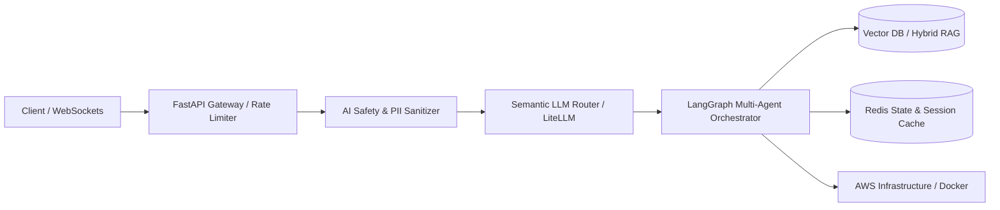

 

  <strong>Crafting production-ready AI applications and high-performance backend systems that solve real-world problems.</strong>

  
  
  
  

---

### 👨‍💻 About Me

I am an **AI Software Engineer & Backend Developer** with a Computer Science background (B.Sc., Mansoura University) focused on moving AI beyond experimental notebooks into reliable, production-ready software.

My experience spans freelance B2B solutions, hands-on enterprise training, and AI alignment:
- **Autonomous & Multi-Agent Workflows:** Designing stateful tool-calling workflows using **LangGraph** with cyclic graphs, memory persistence, and human-in-the-loop review.
- **Production Retrieval-Augmented Generation (RAG):** Engineering hybrid lexical-vector retrieval, semantic reranking, dynamic context windows, and verifiable citation attribution.
- **High-Performance Backends & Microservices:** Building asynchronous APIs with **FastAPI**, **Redis**, **WebSockets**, and containerizing services with **Docker** & **Kubernetes (EKS)**.
- **AI Safety & Alignment:** Practical experience from evaluating frontier LLMs at Outlier/Atlas Capture, implementing prompt injection defenses, and enforcing strict Pydantic output validation.

---

### 🚀 Key Production & Applied AI Projects

<table>
  <thead>
    <tr>
      <th width="28%">System / Project</th>
      <th width="35%">Architecture & Engineering Highlights</th>
      <th width="22%">Tech Stack</th>
      <th width="15%">Links</th>
    </tr>
  </thead>
  <tbody>
    <tr>
      <td>
        <strong>🎙️ AutoHire</strong> 
        <em>Autonomous AI Technical Interviewer</em>
      </td>
      <td>
        • Real-time voice-to-voice streaming with sub-300ms WebSocket latency. 
        • Multi-agent evaluation graph assessing candidate responses against dynamic rubrics. 
        • Multi-tier LLM fallback routing (Groq Qwen-27b + Gemini Flash) ensuring high availability.
      </td>
      <td>
        <code>FastAPI</code> <code>LangGraph</code> 
        <code>WebSockets</code> <code>Redis</code> 
        <code>Next.js</code> <code>TypeScript</code>
      </td>
      <td>
        <a href="https://github.com/ahmedgeeter/ai-interview-automation"><strong>📂 GitHub Repo</strong></a> 
        <a href="https://ai-interview-automation.onrender.com/docs"><strong>⚡ Live Swagger API</strong></a>
      </td>
    </tr>
    <tr>
      <td>
        <strong>🚢 Shiphny AI Support</strong> 
        <em>Logistics & Customer Operations Agent</em>
      </td>
      <td>
        • 5-layer prompt injection defense framework passing penetration tests. 
        • Real-time parcel tracking via RAG over distributed shipment databases. 
        • Automated PII data masking to ensure GDPR-compliant operations.
      </td>
      <td>
        <code>FastAPI</code> <code>LangChain</code> 
        <code>AWS EKS</code> <code>Terraform</code> 
        <code>Redis</code> <code>Docker</code>
      </td>
      <td>
        <a href="https://github.com/ahmedgeeter/shiphny-ai-support"><strong>📂 GitHub Repo</strong></a> 
        <a href="https://shiphny-ai-support.vercel.app/"><strong>🌐 Live Demo</strong></a>
      </td>
    </tr>
    <tr>
      <td>
        <strong>👁️ Meridian AI Auditor</strong> 
        <em>Multimodal Industrial Document & Audio Inspector</em>
      </td>
      <td>
        • Multimodal OCR processing complex schematics and invoices via Llama 3.2 Vision. 
        • Whisper integration for automated voice memo transcription and compliance checks. 
        • Deterministic Pydantic validation for structured data extraction.
      </td>
      <td>
        <code>FastAPI</code> <code>Whisper</code> 
        <code>Llama Vision</code> <code>Pydantic</code> 
        <code>Python</code> <code>OCR</code>
      </td>
      <td>
        <a href="https://github.com/ahmedgeeter/ai-auditor-ocr-voice"><strong>📂 GitHub Repo</strong></a> 
        <a href="https://ai-auditor-ocr-voice.vercel.app/"><strong>🌐 Live Demo</strong></a>
      </td>
    </tr>
    <tr>
      <td>
        <strong>🚨 Autonomous SRE Swarm</strong> 
        <em>Self-Healing Incident Remediation</em>
      </td>
      <td>
        • Multi-agent swarm automating log anomaly detection and root-cause analysis (RCA). 
        • Automated canary rollback workflows and infrastructure alert triage pipelines. 
        • Human-in-the-loop validation nodes for state-modifying actions.
      </td>
      <td>
        <code>Python</code> <code>LangGraph</code> 
        <code>Kubernetes</code> <code>AIOps</code> 
        <code>Observability</code> <code>Docker</code>
      </td>
      <td>
        <a href="https://github.com/ahmedgeeter/Autonomous-SRE-Incident-Remediation-Swarm"><strong>📂 GitHub Repo</strong></a>
      </td>
    </tr>
    <tr>
      <td>
        <strong>🔍 ReqLens Engine</strong> 
        <em>Requirements Clarity & Ambiguity Analyzer</em>
      </td>
      <td>
        • Automated ambiguity detection in software user stories and specifications. 
        • Semantic requirement clustering and interactive specification generation. 
        • Clean Streamlit interface for product and engineering stakeholders.
      </td>
      <td>
        <code>Python</code> <code>NLP</code> 
        <code>Streamlit</code> <code>FastAPI</code> 
        <code>Transformers</code>
      </td>
      <td>
        <a href="https://github.com/ahmedgeeter/ReqLens"><strong>📂 GitHub Repo</strong></a> 
        <a href="https://reqlens.streamlit.app/"><strong>🌐 Live Demo</strong></a>
      </td>
    </tr>
    <tr>
      <td>
        <strong>🏋️ Gym & Fitness RAG Chatbot</strong> 
        <em>Full-Stack Intelligent Fitness Advisory</em>
      </td>
      <td>
        • Context-grounded RAG assistant providing personalized workout & nutritional guidance. 
        • Vector retrieval over verified fitness literature with conversational history. 
        • Full-stack responsive web interface with Tailwind CSS and Next.js.
      </td>
      <td>
        <code>Next.js</code> <code>TypeScript</code> 
        <code>FastAPI</code> <code>RAG</code> 
        <code>PostgreSQL</code>
      </td>
      <td>
        <a href="https://github.com/ahmedgeeter/fullstack-gym-rag-chatbot"><strong>📂 GitHub Repo</strong></a> 
        <a href="https://fullstack-gym-rag-chatbot.vercel.app/"><strong>🌐 Live Demo</strong></a>
      </td>
    </tr>
    <tr>
      <td>
        <strong>⚡ Telegram Store & Commerce Bot</strong> 
        <em>Automated Digital Store with Direct Payments</em>
      </td>
      <td>
        • Asynchronous Telegram bot built with Aiogram 3 and Supabase PostgreSQL. 
        • Integrated InstaPay, Vodafone Cash, and digital currency checkout flows. 
        • Zero-trap Finite State Machine (FSM) navigation for frictionless user experience.
      </td>
      <td>
        <code>Aiogram 3</code> <code>FastAPI</code> 
        <code>PostgreSQL</code> <code>Redis</code> 
        <code>Supabase</code> <code>Vercel</code>
      </td>
      <td>
        <a href="https://github.com/ahmedgeeter/telegram-ai-store-bot"><strong>📂 GitHub Repo</strong></a>
      </td>
    </tr>
    <tr>
      <td>
        <strong>🛡️ AI Safety & Guardrail API</strong> 
        <em>High-Performance LLM Firewall</em>
      </td>
      <td>
        • High-throughput microservice for prompt injection mitigation and jailbreak detection. 
        • Real-time toxicity scoring and automated PII anonymization before upstream LLM calls. 
        • Low latency overhead designed for enterprise API gateways.
      </td>
      <td>
        <code>FastAPI</code> <code>Pydantic</code> 
        <code>Cybersecurity</code> <code>Docker</code> 
        <code>LLM Security</code>
      </td>
      <td>
        <a href="https://github.com/ahmedgeeter/LLM-Safety-Guardrail-API"><strong>📂 GitHub Repo</strong></a>
      </td>
    </tr>
  </tbody>
</table>

---

### 🛡️ System Design & Architecture Principles

- **Deterministic Execution:** LLMs are probabilistic; the systems around them must be deterministic. Every output is strictly validated via Pydantic schemas, retry logic, and circuit breakers.
- **Resilient Fallbacks:** Multi-provider fallback routing (Groq, Gemini, Anthropic, OpenAI) ensures continuous uptime during provider outages or rate limits.
- **Security-First Mindset:** Multi-layer input sanitization, PII masking, and prompt injection filters prevent data leakage and adversarial manipulation.

---

### 🧰 Technical Arsenal

| Domain | Technologies & Frameworks |
| :--- | :--- |
| **AI & Agentic Systems** | `LangGraph` • `LangChain` • `LlamaIndex` • `LiteLLM` • `FAISS` • `ChromaDB` • `Whisper` • `Llama 3.2 Vision` |
| **Backend & Microservices** | `Python (AsyncIO)` • `FastAPI` • `WebSockets` • `Celery` • `Pydantic` • `RESTful Architecture` |
| **Databases & Caching** | `PostgreSQL` • `Supabase` • `Redis (Caching, Pub/Sub, Queues)` • `SQLite` |
| **Cloud & DevOps** | `Docker` • `Kubernetes (EKS)` • `Terraform (IaC)` • `AWS (EC2, S3, IAM)` • `GitHub Actions CI/CD` • `Linux` |
| **Frontend & UI** | `TypeScript` • `Next.js` • `React` • `Tailwind CSS` |

 

---

### 📊 GitHub Activity & Metrics

  <table border="0">
    <tr>
      <td>
        
      </td>
      <td>
        
      </td>
    </tr>
  </table>
  
   

  

---

### 💼 Professional Journey & Experience

- **AI Software Engineer & Freelance Solutions Developer** *(Jan 2024 – Present)*
  - Designed and deployed production-grade RAG systems and multi-agent backend APIs using FastAPI and Python.
  - Implemented multi-provider LLM fallback routing to handle upstream provider limits and maintain application reliability.
  - Built automated CI/CD deployment pipelines using Docker and GitHub Actions.
- **AI Alignment & Evaluation Specialist** *(Atlas Capture & Outlier · Dec 2024 – Jun 2025)*
  - Evaluated and debugged complex Python and TypeScript code generated by frontier LLMs for RLHF alignment datasets.
  - Tested adversarial attack benchmarks and prompt injection mitigation to improve model safety and code accuracy.
- **B.Sc. in Computer Science** *(Mansoura University, Egypt · 2019 – 2023)*

---

### 📬 Get In Touch

I am actively open to **AI Software Engineering roles, Backend Developer positions, and Impactful AI Projects**.

- 💼 **LinkedIn:** [linkedin.com/in/ahmed-ai-dev](https://www.linkedin.com/in/ahmed-ai-dev/)
- 🌐 **Portfolio:** [ahmedgaiter.site](https://www.ahmedgaiter.site/)
- 📧 **Direct Email:** [ahmedekramy303@gmail.com](mailto:ahmedekramy303@gmail.com)
- 📍 **Location:** Egypt (Available for Remote worldwide & Relocation)
