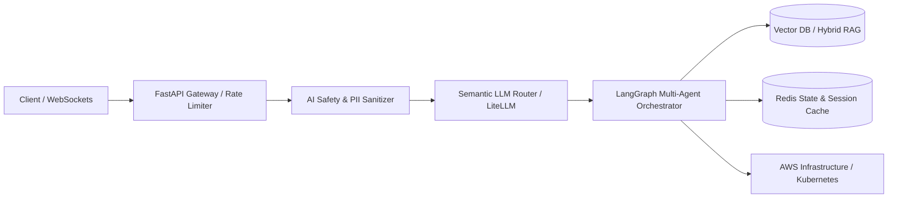

 

  <strong>AI Software Engineer & Backend Developer</strong> 
  Engineering deterministic, production-ready AI systems, agentic workflows, and high-throughput cloud APIs.

  
  
  
  

---

### 👨‍💻 About Me & Engineering Focus

I am an **AI Software Engineer & Backend Developer** with a Computer Science background (B.Sc., Mansoura University) specializing in transforming probabilistic AI models into deterministic, high-throughput production software.

Unlike experimental notebook scripts, I engineer the **low-latency streaming pipelines, stateful agent graphs, and multi-tier safety guardrails** needed to run AI reliably at enterprise scale:
- **Agentic Multi-Step Workflows:** Stateful tool-calling systems using **LangGraph** featuring cyclic execution graphs, memory persistence, and human-in-the-loop review nodes.
- **Production Retrieval-Augmented Generation (RAG):** Hybrid lexical-vector search, semantic reranking, dynamic context windows, and exact citation attribution.
- **Resilient Microservices & Cloud Infrastructure:** Built with **Python (AsyncIO)**, **FastAPI**, **Redis**, and deployed with **Docker**, **Kubernetes (EKS)**, and **Terraform**.
- **AI Safety & Alignment:** Practical experience evaluating frontier LLMs at Outlier/Atlas Capture, implementing multi-layer prompt injection mitigations, and enforcing strict Pydantic output validation.

---

### 🚀 Flagship Production Systems (Live Demos & Architecture)

<table>
  <thead>
    <tr>
      <th width="27%">System / Project</th>
      <th width="37%">Architecture & Engineering Highlights</th>
      <th width="20%">Tech Stack</th>
      <th width="16%">Live Links</th>
    </tr>
  </thead>
  <tbody>
    <tr>
      <td>
        <strong>🎙️ AutoHire</strong> 
        <em>Autonomous AI Technical Interviewer</em>
      </td>
      <td>
        • Full-duplex voice & text assessment platform with sub-300ms WebSocket streaming latency. 
        • Multi-agent LangGraph evaluation graph scoring responses against dynamic rubrics and generating asynchronous scorecards. 
        • Multi-tier LLM fallback routing (Groq Qwen-27b + Gemini Flash) ensuring 99.9% uptime.
      </td>
      <td>
        <code>FastAPI</code> <code>LangGraph</code> 
        <code>WebSockets</code> <code>Redis</code> 
        <code>Next.js 16</code> <code>TypeScript</code>
      </td>
      <td>
        <a href="https://ai-automation-interview.vercel.app/"><strong>🌐 Live Web Demo</strong></a> 
        <a href="https://ai-interview-automation.onrender.com/docs"><strong>⚡ Swagger API</strong></a> 
        <a href="https://github.com/ahmedgeeter/ai-interview-automation"><strong>📂 GitHub Repo</strong></a>
      </td>
    </tr>
    <tr>
      <td>
        <strong>🚢 Shiphny AI Support</strong> 
        <em>Logistics & Customer Operations Agent</em>
      </td>
      <td>
        • Audited 5-layer prompt injection defense framework passing 24/24 penetration attack vectors. 
        • Asynchronous task decoupling via Redis and Celery queues to maintain sub-500ms API response times under load. 
        • Real-time parcel tracking via RAG with automated GDPR-compliant PII data masking.
      </td>
      <td>
        <code>FastAPI</code> <code>LangChain</code> 
        <code>AWS EKS</code> <code>Terraform</code> 
        <code>Redis</code> <code>Docker</code>
      </td>
      <td>
        <a href="https://shiphny-ai-support.vercel.app/"><strong>🌐 Live Demo</strong></a> 
        <a href="https://github.com/ahmedgeeter/shiphny-ai-support"><strong>📂 GitHub Repo</strong></a>
      </td>
    </tr>
    <tr>
      <td>
        <strong>👁️ Meridian AI Auditor</strong> 
        <em>Multimodal Industrial Document & Audio Inspector</em>
      </td>
      <td>
        • Multimodal OCR processing complex engineering schematics and invoices via Llama 3.2 Vision. 
        • Whisper voice integration for automated audio memo transcription and compliance cross-checks. 
        • Strict Pydantic schema validation ensuring deterministic data extraction into downstream ERPs.
      </td>
      <td>
        <code>FastAPI</code> <code>Whisper</code> 
        <code>Llama Vision</code> <code>Pydantic</code> 
        <code>Python</code> <code>OCR</code>
      </td>
      <td>
        <a href="https://ai-auditor-ocr-voice.vercel.app/"><strong>🌐 Live Demo</strong></a> 
        <a href="https://github.com/ahmedgeeter/ai-auditor-ocr-voice"><strong>📂 GitHub Repo</strong></a>
      </td>
    </tr>
    <tr>
      <td>
        <strong>🚨 Autonomous SRE Swarm</strong> 
        <em>Self-Healing Incident Remediation Swarm</em>
      </td>
      <td>
        • Multi-agent AIOps swarm using LangGraph for log anomaly detection and root-cause analysis (RCA). 
        • Automated canary rollback pipelines and self-healing cloud infrastructure remediation workflows. 
        • Human-in-the-loop review gates preventing unauthorized cluster state modifications.
      </td>
      <td>
        <code>Python</code> <code>LangGraph</code> 
        <code>Kubernetes</code> <code>AIOps</code> 
        <code>Observability</code> <code>Docker</code>
      </td>
      <td>
        <a href="https://github.com/ahmedgeeter/Autonomous-SRE-Incident-Remediation-Swarm"><strong>📂 GitHub Repo</strong></a>
      </td>
    </tr>
    <tr>
      <td>
        <strong>🔍 ReqLens Engine</strong> 
        <em>Requirements Ambiguity & Clarity Analyzer</em>
      </td>
      <td>
        • Automated linguistic ambiguity and conflict detection in software user stories. 
        • Semantic requirement clustering and interactive specification generation via Gemini 2.5 Flash. 
        • Clean Streamlit interface tailored for engineering teams and product managers.
      </td>
      <td>
        <code>Python</code> <code>NLP</code> 
        <code>Streamlit</code> <code>FastAPI</code> 
        <code>Transformers</code>
      </td>
      <td>
        <a href="https://reqlens.streamlit.app/"><strong>🌐 Live Demo</strong></a> 
        <a href="https://github.com/ahmedgeeter/ReqLens"><strong>📂 GitHub Repo</strong></a>
      </td>
    </tr>
    <tr>
      <td>
        <strong>🏋️ Gym & Fitness RAG Chatbot</strong> 
        <em>Full-Stack Intelligent Fitness Advisory</em>
      </td>
      <td>
        • Hybrid lexical-vector RAG assistant providing context-grounded workout & nutritional plans. 
        • Vector retrieval over verified fitness literature with multi-turn conversational memory in PostgreSQL. 
        • Full-stack responsive web application built with Next.js, Tailwind CSS, and FastAPI.
      </td>
      <td>
        <code>Next.js</code> <code>TypeScript</code> 
        <code>FastAPI</code> <code>RAG</code> 
        <code>PostgreSQL</code>
      </td>
      <td>
        <a href="https://fullstack-gym-rag-chatbot.vercel.app/"><strong>🌐 Live Demo</strong></a> 
        <a href="https://github.com/ahmedgeeter/fullstack-gym-rag-chatbot"><strong>📂 GitHub Repo</strong></a>
      </td>
    </tr>
    <tr>
      <td>
        <strong>⚡ Telegram Store & Commerce Bot</strong> 
        <em>High-Concurrency Digital Storefront Bot</em>
      </td>
      <td>
        • Asynchronous serverless bot powered by Aiogram 3, Supabase PostgreSQL, and Redis caching. 
        • Integrated InstaPay, Vodafone Cash, and digital currency checkout flows with zero-trap FSM. 
        • Sub-second cold starts with automated keep-alive health monitoring on Vercel.
      </td>
      <td>
        <code>Aiogram 3</code> <code>FastAPI</code> 
        <code>PostgreSQL</code> <code>Redis</code> 
        <code>Supabase</code> <code>Vercel</code>
      </td>
      <td>
        <a href="https://github.com/ahmedgeeter/Fully-functional-Telegram-RAG-Agent"><strong>📂 GitHub Repo</strong></a>
      </td>
    </tr>
    <tr>
      <td>
        <strong>🛡️ AI Safety & Guardrail API</strong> 
        <em>High-Throughput LLM Security Firewall</em>
      </td>
      <td>
        • High-speed FastAPI middleware intercepting prompts before upstream LLM inference. 
        • Real-time prompt injection mitigation, jailbreak detection, and toxicity scoring. 
        • Sub-millisecond latency overhead engineered for enterprise API gateways.
      </td>
      <td>
        <code>FastAPI</code> <code>Pydantic</code> 
        <code>Cybersecurity</code> <code>Docker</code> 
        <code>LLM Security</code>
      </td>
      <td>
        <a href="https://github.com/ahmedgeeter/LLM-Safety-Guardrail-API"><strong>📂 GitHub Repo</strong></a>
      </td>
    </tr>
  </tbody>
</table>

---

### 🛡️ System Design & Architecture Principles

- **Deterministic Execution:** LLMs are probabilistic; the systems wrapping them must be deterministic. Every output is strictly validated via Pydantic schemas, retry logic, and circuit breakers.
- **Resilient Fallbacks:** Multi-provider fallback routing (Groq, Gemini, Anthropic, OpenAI) ensures continuous uptime during provider outages or rate limits.
- **Security-First Mindset:** Multi-layer input sanitization, PII masking, and prompt injection filters prevent data leakage and adversarial manipulation.

---

### 🧰 Technical Arsenal

| Domain | Technologies & Frameworks |
| :--- | :--- |
| **AI & Agentic Systems** | `LangGraph` • `LangChain` • `LlamaIndex` • `LiteLLM` • `FAISS` • `ChromaDB` • `Whisper` • `Llama 3.2 Vision` |
| **Backend & Microservices** | `Python (AsyncIO)` • `FastAPI` • `WebSockets` • `Celery` • `Pydantic` • `RESTful Architecture` |
| **Databases & Caching** | `PostgreSQL` • `Supabase` • `Redis (Caching, Pub/Sub, Queues)` • `SQLite` |
| **Cloud & DevOps** | `Docker` • `Kubernetes (EKS)` • `Terraform (IaC)` • `AWS (EC2, S3, IAM)` • `GitHub Actions CI/CD` • `Linux` |
| **Frontend & UI** | `TypeScript` • `Next.js` • `React` • `Tailwind CSS` |

 

---

### 📊 GitHub Activity & Metrics

  <table border="0">
    <tr>
      <td>
        
      </td>
      <td>
        
      </td>
    </tr>
  </table>
  
   

  

---

### 💼 Professional Journey & Experience

- **AI Software Engineer & Freelance Solutions Developer** *(Jan 2024 – Present)*
  - Designed and deployed production-grade RAG systems and multi-agent backend APIs using FastAPI and Python.
  - Implemented multi-provider LLM fallback routing to handle upstream provider limits and maintain application reliability.
  - Built automated CI/CD deployment pipelines using Docker and GitHub Actions.
- **AI Alignment & Evaluation Specialist** *(Atlas Capture & Outlier · Dec 2024 – Jun 2025)*
  - Evaluated and debugged complex Python and TypeScript code generated by frontier LLMs for RLHF alignment datasets.
  - Tested adversarial attack benchmarks and prompt injection mitigation to improve model safety and code accuracy.
- **B.Sc. in Computer Science** *(Mansoura University, Egypt · 2019 – 2023)*

---

### 📬 Get In Touch

I am actively open to **AI Software Engineering roles, Backend Developer positions, and Impactful AI Projects**.

- 💼 **LinkedIn:** [linkedin.com/in/ahmed-ai-dev](https://www.linkedin.com/in/ahmed-ai-dev/)
- 🌐 **Portfolio:** [ahmedgaiter.site](https://www.ahmedgaiter.site/)
- 📧 **Direct Email:** [ahmedekramy303@gmail.com](mailto:ahmedekramy303@gmail.com)
- 📍 **Location:** Egypt (Available for Remote worldwide & Relocation)
