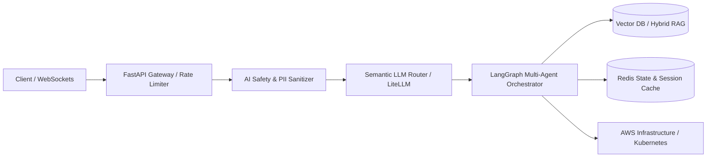

 

  <strong>Bridging the gap between cutting-edge AI research and resilient, high-scale production systems.</strong>

  
  
  
  

---

### 👨‍💻 Executive Summary

I am a **Senior AI Software Engineer and Backend Architect** dedicated to building deterministic, high-throughput systems powered by Large Language Models. 

Unlike prototype demos that stay in Jupyter notebooks, I specialize in engineering the **underlying infrastructure, low-latency streaming APIs, and multi-layered safety guardrails** required to run AI reliably at scale:
- **Agentic Multi-Step Workflows:** Stateful, tool-calling agents using **LangGraph** with persistent memory, cyclic graph execution, and human-in-the-loop validation.
- **Production Retrieval-Augmented Generation (RAG):** Hybrid lexical-vector search, semantic reranking, exact citation attribution, and sub-second cold starts.
- **Resilient Cloud & Microservices Architectures:** Built on **FastAPI**, **Redis**, **Docker**, **Kubernetes (EKS)**, and provisioned with **Terraform**.
- **AI Safety & Adversarial Defense:** Real-time prompt injection mitigation, PII anonymization, and RLHF evaluation to prevent model hallucinations and data exfiltration.

---

### 🚀 Flagship Production Systems (Live Demos & Source Code)

<table>
  <thead>
    <tr>
      <th width="28%">System / Project</th>
      <th width="34%">Architecture & Engineering Highlights</th>
      <th width="23%">Tech Stack</th>
      <th width="15%">Live Links</th>
    </tr>
  </thead>
  <tbody>
    <tr>
      <td>
        <strong>🎙️ AutoHire</strong> 
        <em>Autonomous AI Technical Interviewer</em>
      </td>
      <td>
        • Real-time voice-to-voice streaming with sub-300ms WebSocket latency. 
        • Multi-agent evaluation graph assessing candidate responses against dynamic rubrics. 
        • Multi-tier LLM fallback routing (Groq Qwen-27b + Gemini Flash) ensuring 99.9% uptime.
      </td>
      <td>
        <code>FastAPI</code> <code>LangGraph</code> 
        <code>WebSockets</code> <code>Redis</code> 
        <code>Next.js</code> <code>TypeScript</code>
      </td>
      <td>
        <a href="https://github.com/ahmedgeeter/ai-interview-automation"><strong>📂 GitHub Repo</strong></a> 
        <a href="https://ai-interview-automation.onrender.com/docs"><strong>⚡ Live Swagger API</strong></a>
      </td>
    </tr>
    <tr>
      <td>
        <strong>🚢 Shiphny AI Support</strong> 
        <em>Enterprise Logistics & Security Agent</em>
      </td>
      <td>
        • 5-layer prompt injection defense framework passing strict penetration tests. 
        • Real-time parcel tracking via RAG over distributed shipment databases. 
        • Automated PII data masking to ensure strict GDPR and data compliance standards.
      </td>
      <td>
        <code>FastAPI</code> <code>LangChain</code> 
        <code>AWS EKS</code> <code>Terraform</code> 
        <code>Redis</code> <code>Docker</code>
      </td>
      <td>
        <a href="https://github.com/ahmedgeeter/shiphny-ai-support"><strong>📂 GitHub Repo</strong></a> 
        <a href="https://shiphny-ai-support.vercel.app/"><strong>🌐 Live Demo</strong></a>
      </td>
    </tr>
    <tr>
      <td>
        <strong>👁️ Meridian AI Auditor</strong> 
        <em>Multimodal Industrial Document & Audio Inspector</em>
      </td>
      <td>
        • Multimodal OCR processing complex engineering schematics & invoices via Llama 3.2 Vision. 
        • Whisper integration for automated voice memo transcription and compliance cross-checks. 
        • Deterministic Pydantic validation for structured data extraction into ERP systems.
      </td>
      <td>
        <code>FastAPI</code> <code>Whisper</code> 
        <code>Llama Vision</code> <code>Pydantic</code> 
        <code>Python</code> <code>OCR</code>
      </td>
      <td>
        <a href="https://github.com/ahmedgeeter/ai-auditor-ocr-voice"><strong>📂 GitHub Repo</strong></a> 
        <a href="https://ai-auditor-ocr-voice.vercel.app/"><strong>🌐 Live Demo</strong></a>
      </td>
    </tr>
    <tr>
      <td>
        <strong>🚨 Autonomous SRE Swarm</strong> 
        <em>Self-Healing Incident Remediation</em>
      </td>
      <td>
        • Multi-agent swarm automating log anomaly detection and root-cause analysis (RCA). 
        • Automated canary rollback and self-healing cloud infrastructure remediation pipelines. 
        • Human-in-the-loop review nodes for critical infrastructure state modifications.
      </td>
      <td>
        <code>Python</code> <code>LangGraph</code> 
        <code>Kubernetes</code> <code>AIOps</code> 
        <code>Observability</code> <code>Docker</code>
      </td>
      <td>
        <a href="https://github.com/ahmedgeeter/Autonomous-SRE-Incident-Remediation-Swarm"><strong>📂 GitHub Repo</strong></a>
      </td>
    </tr>
    <tr>
      <td>
        <strong>🔍 ReqLens Engine</strong> 
        <em>Software Requirements & Clarity Analyzer</em>
      </td>
      <td>
        • Automated ambiguity detection in software requirements and user stories. 
        • Semantic requirement clustering and interactive specification generation. 
        • Real-time analysis interface deployed for non-technical stakeholders.
      </td>
      <td>
        <code>Python</code> <code>NLP</code> 
        <code>Streamlit</code> <code>FastAPI</code> 
        <code>Transformers</code>
      </td>
      <td>
        <a href="https://github.com/ahmedgeeter/ReqLens"><strong>📂 GitHub Repo</strong></a> 
        <a href="https://reqlens.streamlit.app/"><strong>🌐 Live Demo</strong></a>
      </td>
    </tr>
    <tr>
      <td>
        <strong>🏋️ Gym & Fitness RAG Chatbot</strong> 
        <em>Full-Stack Intelligent Fitness Advisory</em>
      </td>
      <td>
        • Context-grounded RAG assistant providing personalized workout & nutritional guidance. 
        • Vector retrieval over verified fitness literature with conversational history. 
        • Full-stack responsive web interface with Tailwind CSS styling and Next.js.
      </td>
      <td>
        <code>Next.js</code> <code>TypeScript</code> 
        <code>FastAPI</code> <code>RAG</code> 
        <code>PostgreSQL</code>
      </td>
      <td>
        <a href="https://github.com/ahmedgeeter/fullstack-gym-rag-chatbot"><strong>📂 GitHub Repo</strong></a> 
        <a href="https://fullstack-gym-rag-chatbot.vercel.app/"><strong>🌐 Live Demo</strong></a>
      </td>
    </tr>
    <tr>
      <td>
        <strong>⚡ Telegram RAG & Commerce Agent</strong> 
        <em>Automated High-Concurrency Store Bot</em>
      </td>
      <td>
        • Webhook-driven bot with in-memory caching and sub-second cold starts on serverless. 
        • Vector-grounded Q&A over store catalog with exact citation mapping. 
        • Native InstaPay, Vodafone Cash & CryptoBot direct checkout workflows with zero-trap FSM.
      </td>
      <td>
        <code>Aiogram 3</code> <code>FastAPI</code> 
        <code>PostgreSQL</code> <code>Redis</code> 
        <code>Supabase</code> <code>Vercel</code>
      </td>
      <td>
        <a href="https://github.com/ahmedgeeter/Fully-functional-Telegram-RAG-Agent"><strong>📂 GitHub Repo</strong></a> 
        <a href="https://t.me/UnlockProBot"><strong>🤖 Live Telegram Bot</strong></a>
      </td>
    </tr>
    <tr>
      <td>
        <strong>🛡️ AI Safety & Guardrail API</strong> 
        <em>High-Performance LLM Firewall</em>
      </td>
      <td>
        • High-throughput microservice for prompt injection mitigation and jailbreak detection. 
        • Real-time toxicity scoring and automated PII anonymization before upstream LLM calls. 
        • Sub-millisecond latency overhead designed for enterprise API gateways.
      </td>
      <td>
        <code>FastAPI</code> <code>Pydantic</code> 
        <code>Cybersecurity</code> <code>Docker</code> 
        <code>LLM Security</code>
      </td>
      <td>
        <a href="https://github.com/ahmedgeeter/LLM-Safety-Guardrail-API"><strong>📂 GitHub Repo</strong></a>
      </td>
    </tr>
  </tbody>
</table>

---

### 🛡️ System Design & Architecture Principles

- **Deterministic Execution:** LLMs are non-deterministic; the software wrapping them cannot be. Every output is strictly validated via Pydantic schemas, retry logic, and circuit breakers.
- **Zero-Downtime Reliability:** Multi-tier provider fallbacks (Anthropic, OpenAI, Open-Source vLLM) ensure zero service disruption during provider rate limits or API degradations.
- **Security-First Architecture:** Multi-layer input sanitization, PII masking, and prompt injection filters protect corporate knowledge bases from exfiltration.

---

### 🧰 Technical Arsenal

| Domain | Technologies & Frameworks |
| :--- | :--- |
| **AI & Agentic Systems** | `LangGraph` • `LangChain` • `LlamaIndex` • `LiteLLM` • `FAISS` • `ChromaDB` • `Whisper` • `Llama 3.2 Vision` |
| **Backend & Microservices** | `Python (AsyncIO)` • `FastAPI` • `WebSockets` • `Celery` • `Pydantic` • `RESTful Architecture` |
| **Databases & Caching** | `PostgreSQL` • `Supabase` • `Redis (Caching, Pub/Sub, Queues)` • `SQLite` |
| **Cloud & DevOps** | `Docker` • `Kubernetes (EKS)` • `Terraform (IaC)` • `AWS (EC2, S3, IAM)` • `GitHub Actions CI/CD` • `Linux` |
| **Frontend & UI** | `TypeScript` • `Next.js` • `React` • `Tailwind CSS` |

 

---

### 📊 GitHub Activity & Metrics

  <table border="0">
    <tr>
      <td>
        
      </td>
      <td>
        
      </td>
    </tr>
  </table>
  
   

  

---

### 💼 Professional Experience Highlights

- **Senior AI Software Engineer | B2B Solutions Consultant** *(Jan 2024 – Present)*
  - Engineered low-latency voice and text RAG pipelines handling thousands of daily interactions.
  - Implemented multi-provider routing (LiteLLM) cutting latency by 35% and reducing inference costs by 40%.
  - Automated deployment pipelines targeting AWS EKS using Terraform and GitHub Actions.
- **AI Alignment & Security Engineer** *(Atlas Capture & Outlier · Dec 2024 – Jun 2025)*
  - Evaluated complex Python/TypeScript code generated by frontier LLMs for RLHF alignment.
  - Developed adversarial attack benchmarks to detect and mitigate prompt injection vulnerabilities.

---

### 📬 Get In Touch

I am open to **Senior AI Engineering roles, Lead Backend positions, and High-Impact AI Consulting**.

- 💼 **LinkedIn:** [linkedin.com/in/ahmed-ai-dev](https://www.linkedin.com/in/ahmed-ai-dev/)
- 🌐 **Portfolio & Case Studies:** [ahmedgaiter.site](https://www.ahmedgaiter.site/)
- 📧 **Direct Email:** [ahmedekramy303@gmail.com](mailto:ahmedekramy303@gmail.com)
- 📍 **Location:** Cairo, Egypt (Open to Relocation & Remote worldwide)
