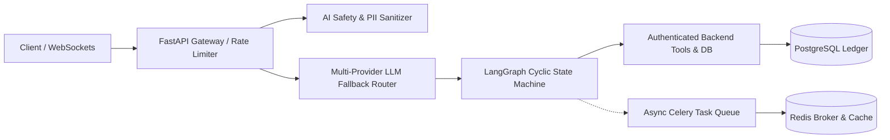

<div align="center">

# Ahmed Gaiter
### AI & Backend Software Engineer

Building resilient, asynchronous Python backends, stateful multi-agent workflows (LangGraph), and deterministic LLM pipelines.

<br/>

[](https://www.ahmedgaiter.site/)
[](https://www.linkedin.com/in/ahmed-ai-dev/)
[](https://github.com/ahmedgeeter)
[](mailto:ahmedekramy303@gmail.com)
[](https://maps.google.com)

</div>

---

### 💡 Engineering Focus

While Large Language Models are inherently probabilistic, production systems wrapping them must be deterministic, fault-tolerant, and observable.

My work centers on the backend infrastructure that makes AI reliable in production:
- **Asynchronous API Architectures:** Low-latency API gateways, full-duplex WebSockets, and non-blocking streaming built with **Python (AsyncIO)** and **FastAPI**.
- **Stateful Agentic Workflows:** Multi-step cyclical graphs using **LangGraph**, enforcing strict tool-calling boundaries, state checkpointing, and dynamic evaluator rubrics.
- **Distributed Concurrency & Queuing:** Decoupling compute-heavy inference and evaluation pipelines to **Celery workers** backed by **Redis** and **PostgreSQL**.
- **Resilience & Safety:** Multi-provider fallback chains (Groq ➔ Gemini ➔ OpenAI), regex-compiled injection mitigations, and strict **Pydantic v2** schema contracts.

---

### 🏛️ System Architecture


```mermaid
graph LR
    Client[Client / WebSockets] --> Gateway[FastAPI Gateway / Rate Limiter]
    Gateway --> Guardrail[AI Safety & PII Sanitizer]
    Gateway --> Router[Multi-Provider LLM Fallback Router]
    Router --> Agents[LangGraph Cyclic State Machine]
    Agents --> Tools[Authenticated Backend Tools & DB]
    Agents -.-> Queue[Async Celery Task Queue]
    Queue --> Redis[(Redis Broker & Cache)]
    Tools --> Postgres[(PostgreSQL Ledger)]
```

---

### 🚀 Flagship Engineering Projects

<table>
  <thead>
    <tr>
      <th width="24%">Project</th>
      <th width="42%">Architecture & Highlights</th>
      <th width="20%">Tech Stack</th>
      <th width="14%">Links</th>
    </tr>
  </thead>
  <tbody>
    <tr>
      <td>
        <strong>🎙️ AutoHire</strong><br/>
        <em>Autonomous AI Technical Interviewer</em>
      </td>
      <td>
        • Full-duplex WebSocket architecture in FastAPI for bi-directional streaming interaction.<br/>
        • Event-driven LangGraph state machine calibrating question depth and seniority dynamically.<br/>
        • Scoring and analysis offloaded to asynchronous Celery workers backed by Redis to keep WebSocket loops non-blocking.<br/>
        • Multi-provider fallback routing (Groq LPU ➔ Gemini Flash) for uninterrupted live sessions.<br/>
        • Comprehensive Pytest integration suite for connection lifecycles and graph transitions.
      </td>
      <td>
        <code>Python (AsyncIO)</code><br/>
        <code>FastAPI</code> <code>WebSockets</code><br/>
        <code>LangGraph</code> <code>Celery</code><br/>
        <code>Redis</code> <code>Pytest</code><br/>
        <code>Next.js</code> <code>TypeScript</code>
      </td>
      <td>
        <a href="https://ai-automation-interview.vercel.app/"><strong>🌐 Live Demo</strong></a><br/>
        <a href="https://github.com/ahmedgeeter/ai-interview-automation"><strong>📂 GitHub</strong></a>
      </td>
    </tr>
    <tr>
      <td>
        <strong>👁️ Meridian</strong><br/>
        <em>Multimodal Document & Vocal Inspector</em>
      </td>
      <td>
        • Vision-language pipeline parsing complex engineering blueprints and invoices via Llama 3.2 Vision.<br/>
        • Whisper voice integration enabling real-time vocal compliance audits with Voice Activity Detection (VAD).<br/>
        • Deterministic output extraction enforced via strict Pydantic v2 validation models, preventing schema drift.
      </td>
      <td>
        <code>Python</code> <code>FastAPI</code><br/>
        <code>Llama 3.2 Vision</code><br/>
        <code>Whisper</code> <code>Pydantic v2</code><br/>
        <code>React</code> <code>TypeScript</code>
      </td>
      <td>
        <a href="https://ai-auditor-ocr-voice.vercel.app/"><strong>🌐 Live Demo</strong></a><br/>
        <a href="https://github.com/ahmedgeeter/ai-auditor-ocr-voice"><strong>📂 GitHub</strong></a>
      </td>
    </tr>
    <tr>
      <td>
        <strong>🚢 Shiphny</strong><br/>
        <em>Multi-Agent Logistics Platform</em>
      </td>
      <td>
        • LangGraph cyclic state machine enforcing authenticated tool boundaries (tracking, cancellation, billing).<br/>
        • Decoupled background workflows with Redis session storage and PostgreSQL ledgers managed via Alembic migrations.<br/>
        • Automated multi-provider LLM fallback routing chained across Groq and Gemini.<br/>
        • Automated CI/CD pipeline building multi-stage Docker images to GitHub Container Registry (GHCR).
      </td>
      <td>
        <code>FastAPI</code> <code>LangGraph</code><br/>
        <code>PostgreSQL</code> <code>Redis</code><br/>
        <code>Docker</code> <code>CI/CD</code><br/>
        <code>Terraform</code> <code>Helm</code>
      </td>
      <td>
        <a href="https://shiphny-ai-support.vercel.app/"><strong>🌐 Live Demo</strong></a><br/>
        <a href="https://github.com/ahmedgeeter/shiphny-ai-support"><strong>📂 GitHub</strong></a>
      </td>
    </tr>
    <tr>
      <td>
        <strong>🛡️ AI Guardrail API</strong><br/>
        <em>High-Throughput Safety Middleware</em>
      </td>
      <td>
        • Pre-flight prompt inspection middleware catching adversarial injection and jailbreak patterns.<br/>
        • Automated regex-compiled PII sanitization (Emails, Phones, Credit Cards, API Keys, SSNs).<br/>
        • Optimized for sub-5ms heuristic evaluation overhead with zero external ML runtime dependencies.<br/>
        • Fully tested with Pytest covering clean queries, attack attempts, and redaction verification.
      </td>
      <td>
        <code>Python</code> <code>FastAPI</code><br/>
        <code>Pydantic v2</code> <code>Docker</code><br/>
        <code>Regex Automata</code><br/>
        <code>Pytest</code>
      </td>
      <td>
        <a href="https://github.com/ahmedgeeter/LLM-Safety-Guardrail-API"><strong>📂 GitHub</strong></a>
      </td>
    </tr>
  </tbody>
</table>

---

### 🛠️ Technical Stack

```
Languages:            Python (AsyncIO, Concurrency), TypeScript, JavaScript, SQL (PostgreSQL), Bash
AI & Agents:          LangGraph, RAG Architecture, Tool-Calling Guardrails, LiteLLM, Whisper, Vision LLMs
Backend & Queues:     FastAPI, Full-Duplex WebSockets, Redis (Pub/Sub & Caching), Celery, Pydantic v2
Databases & Storage:  PostgreSQL, Alembic Migrations, SQLite, Redis
DevOps & Cloud:       Docker, Docker Compose, Kubernetes Manifests, GitHub Actions (CI/CD), Linux
Testing & Quality:    Pytest, Async Testing, Mock Fixtures, Strict Schema Typing
```

---

### 💼 Professional Journey

- **Software Engineer (AI & Backend) | Independent Contractor** *(Jan 2024 – Present)*
  - Designed and deployed asynchronous RAG pipelines and multi-agent backend APIs using FastAPI and Python.
  - Implemented multi-provider LLM fallback routing to eliminate upstream rate limits and ensure service uptime.
  - Architected asynchronous task queues backed by Redis to decouple heavy inference workflows from API response loops.

- **AI Integration Engineer | Springer Capital** *(Remote Contract · May 2025 – Sep 2025)*
  - Developed custom Python automation scripts and LLM endpoints for operational workflow synchronization.
  - Standardized data schemas across ingestion pipelines in collaboration with a remote engineering team.

- **AI Alignment & Code Security Specialist | Atlas Capture** *(Remote Contract · Dec 2024 – Feb 2025)*
  - Audited and debugged complex Python and TypeScript code generated by frontier LLMs for RLHF alignment benchmarks.
  - Evaluated prompt injection vectors and adversarial attack datasets to reinforce model response reliability.

- **B.Sc. in Computer Science** *(Mansoura University, Egypt · 2019 – 2023)*

---

### 📬 Contact & Links

- 🌐 **Portfolio:** [ahmedgaiter.site](https://www.ahmedgaiter.site/)
- 💼 **LinkedIn:** [linkedin.com/in/ahmed-ai-dev](https://www.linkedin.com/in/ahmed-ai-dev/)
- 📧 **Email:** [ahmedekramy303@gmail.com](mailto:ahmedekramy303@gmail.com)
- 📍 **Location:** Cairo, Egypt (Available for Remote worldwide & Relocation)
